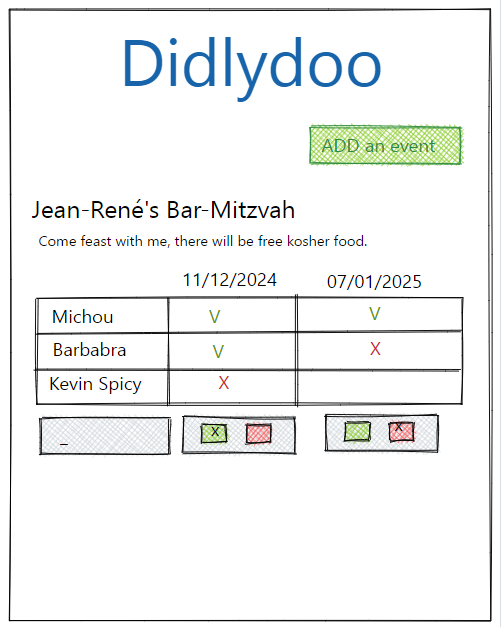

<div align="center"></img></div>
  
# 𝚃𝚊𝚋𝚕𝚎 𝚘𝚏 𝚌𝚘𝚗𝚝𝚎𝚗𝚝𝚜:
* 𝙶𝚛𝚘𝚞𝚙 𝙼𝚎𝚖𝚋𝚎𝚛𝚜;
* 𝚃𝚑𝚎 𝙰𝚜𝚜𝚒𝚐𝚗𝚖𝚎𝚗𝚝;
* 𝙷𝚘𝚠 𝚠𝚎 𝚖𝚊𝚗𝚊𝚐𝚎𝚍 𝚎𝚊𝚌𝚑 𝚝𝚊𝚜𝚔;
* 𝚄𝚜𝚎𝚍 𝚝𝚎𝚌𝚑𝚗𝚘𝚕𝚘𝚐𝚒𝚎𝚜;
* 𝚃𝚘𝚞𝚐𝚑𝚝𝚜;
* 𝙶𝚒𝚝𝚑𝚋𝚞𝚋 𝚙𝚊𝚐𝚎 𝚕𝚒𝚗𝚔;

# 𝙶𝚛𝚘𝚞𝚙 𝙼𝚎𝚖𝚋𝚎𝚛𝚜


<div align="center"> 
  
  ##  𝚆𝚎 𝚊𝚛𝚎 𝚝𝚑𝚎 𝚖𝚎𝚖𝚋𝚎𝚛𝚜 𝚘𝚏 𝚝𝚑𝚎 𝚐𝚛𝚘𝚞𝚙 𝚗 𝟷; 
  
</div>

# 𝚃𝚑𝚎 𝙰𝚜𝚜𝚒𝚐𝚗𝚖𝚎𝚗𝚝
You have been hired by a "truly disruptive" startup, to create a revolutionary tool to plan events with friends and relatives. Introducing Didlydoo, the event planner!

A backend developer has already created an API for the tool, so you can focus on the frontend. The list of endpoints is available below.

Your tasks is to :

🌱 Display all the events, including everyone's availability
🌱 Allow users to create events
🌱 Allow users to add their availability to an existing event
🌱 Edit an event name/description/author
🌱 Delete an event
🌱 You must validate your inputs before sending the data to your backend, inputs required must be filed and shorter than 256 characters. If it's not the case you don't send the request and display the appropriate error below the input.
Bonus :

🌼 Display the best possible date for the event according to everyone availabilities
Constrains:

``` No js libraries, or frameworks```

This is the mockup that the company founder has drawn on a piece of paper during a lunch break (you can use it, or create your own layout).

 </img>

Backend setup:

Clone the backend directory on your computer and open in it in a terminal, then type npm install once to install the dependencies.

To launch the server simply type node server/index.mjs to start the server (the terminal has to remain open and running).


<div align="center"> 
  
# ԼЄƬ'Ƨ ƊƠ ƖƬ....

</img>
</div>

# 𝙷𝚘𝚠 𝚠𝚎 𝚖𝚊𝚗𝚊𝚐𝚎𝚍 𝚎𝚊𝚌𝚑 𝚝𝚊𝚜𝚔;

𝚉𝚊𝚑𝚛𝚊: <br>
𝙵𝚛𝚘𝚗𝚝𝚎𝚗𝚍;
  * 𝙱𝚊𝚜𝚒𝚌  𝚜𝚝𝚛𝚞𝚌𝚝𝚞𝚛𝚎 𝚒𝚗 𝙷𝚃𝙼𝙻 𝚊𝚗𝚍 𝙲𝚂𝚂 (𝙷𝚎𝚊𝚍𝚎𝚛 𝚊𝚗𝚍 𝙵𝚘𝚘𝚝𝚎𝚛);
  * 𝙳𝚊𝚛𝚔-𝙼𝚘𝚍𝚎;
  * 𝚁𝚎𝚊𝚍𝚖𝚎 𝚏𝚒𝚕𝚎;
    

𝙲𝚊𝚛𝚘𝚕𝚒𝚗𝚎: <br>
𝙱𝚊𝚌𝚔𝚎𝚗𝚍;
* 𝙹𝚊𝚟𝚊𝚜𝚌𝚛𝚒𝚙𝚝 '𝚍𝚒𝚜𝚙𝚕𝚊𝚢𝙴𝚟𝚎𝚗𝚝' 𝚏𝚞𝚗𝚌𝚝𝚒𝚘𝚗 𝚝𝚘 𝚛𝚎𝚝𝚛𝚒𝚎𝚟𝚎 𝚎𝚟𝚎𝚗𝚝𝚜, 𝚏𝚛𝚘𝚖 𝚝𝚑𝚎 𝚊𝚙𝚒, 𝚒𝚗𝚌𝚕𝚞𝚍𝚒𝚗𝚐:
* 𝙳𝚎𝚜𝚌𝚛𝚒𝚙𝚝𝚒𝚘𝚗;
* 𝙳𝚊𝚝𝚎;
* 𝙻𝚒𝚜𝚝 𝚘𝚏 𝚊𝚝𝚝𝚎𝚗𝚍𝚎𝚎𝚜;
* 𝚃𝚑𝚎𝚒𝚛 𝚊𝚟𝚊𝚒𝚕𝚊𝚋𝚒𝚕𝚒𝚝𝚢 𝚊𝚗𝚍 𝚍𝚒𝚜𝚙𝚕𝚊𝚢 𝚊𝚕𝚕 𝚝𝚑𝚎 𝚒𝚗𝚏𝚘𝚛𝚖𝚊𝚝𝚒𝚘𝚗 𝚒𝚗 𝚝𝚑𝚎 𝚛𝚎𝚜𝚙𝚎𝚌𝚝𝚒𝚟𝚎 𝚌𝚘𝚗𝚝𝚊𝚒𝚗𝚎𝚛𝚜 + 𝙲𝚂𝚂;
* 𝙳𝚎𝚕𝚎𝚝𝚎 𝚎𝚟𝚎𝚗𝚝 𝚏𝚞𝚗𝚌𝚝𝚒𝚘𝚗 + 𝙲𝚂𝚂;
* 𝙼𝚘𝚍𝚒𝚏𝚢 𝚊𝚝𝚝𝚎𝚗𝚍𝚎𝚎𝚜;
* 𝙳𝚎𝚕𝚎𝚝𝚎 𝚎𝚟𝚎𝚗𝚝 𝚏𝚞𝚗𝚌𝚝𝚒𝚘𝚗 + 𝙲𝚂𝚂;
* 𝙼𝚘𝚍𝚒𝚏𝚢 𝚊𝚝𝚝𝚎𝚗𝚍𝚎𝚎𝚜;
  
  </img>

𝙸𝚕𝚒𝚎𝚜𝚜: <br>
𝙱𝚊𝚌𝚔𝚎𝚗𝚍;
*  𝙼𝚘𝚍𝚊𝚕 '𝚊𝚍𝚍𝙴𝚟𝚎𝚗𝚝' + 𝙲𝚂𝚂;
* '𝚙𝚊𝚝𝚌𝚑_𝚎𝚟𝚎𝚗𝚝';
* '𝙿𝚘𝚜𝚝_𝚎𝚟𝚎𝚗𝚝';
* '𝙿𝚘𝚜𝚝_𝚗𝚎𝚠𝙳𝚊𝚝𝚎';
* '𝚖𝚘𝚍𝚒𝚏𝚢𝙼𝚘𝚍𝚊𝚕' 𝚏𝚞𝚗𝚌𝚝𝚒𝚘𝚗;

# 𝚄𝚜𝚎𝚍 𝚝𝚎𝚌𝚑𝚗𝚘𝚕𝚘𝚐𝚒𝚎𝚜
* HTML
* CSS
* JavaScript
* Node.js
* Postman App
* VsCode

  
<div align="center"> 


</div>

# 𝚃𝚘𝚞𝚐𝚑𝚝𝚜;

</img>

ᴢᴀʜʀᴀ: "𝙸 𝚛𝚎𝚊𝚕𝚕𝚢 𝚕𝚒𝚔𝚎𝚍 𝚝𝚑𝚎 𝚌𝚑𝚊𝚕𝚕𝚎𝚗𝚐𝚎 𝚘𝚏 𝚝𝚑𝚒𝚜 𝚊𝚜𝚜𝚒𝚐𝚗𝚖𝚎𝚗𝚝. 𝙼𝚢 𝚝𝚎𝚊𝚖 𝚖𝚎𝚖𝚋𝚎𝚛𝚜 𝚊𝚛𝚎 𝚊𝚖𝚊𝚣𝚒𝚗𝚐𝚕𝚢 𝚝𝚊𝚕𝚎𝚗𝚝𝚎𝚍 𝚊𝚗𝚍 𝚛𝚎𝚊𝚕-𝚕𝚒𝚏𝚎 𝙹𝚂 𝚖𝚊𝚜𝚝𝚎𝚛𝚜! 
𝙸 𝚏𝚘𝚞𝚗𝚍 𝚜𝚘𝚖𝚎 𝚍𝚒𝚏𝚏𝚒𝚌𝚞𝚕𝚝𝚒𝚎𝚜 𝚞𝚗𝚍𝚎𝚛𝚜𝚝𝚊𝚗𝚍𝚒𝚗𝚐 𝚜𝚘𝚖𝚎 𝚙𝚊𝚛𝚝𝚜 𝚘𝚏 𝚝𝚑𝚎 𝚌𝚘𝚍𝚎, 𝚋𝚞𝚝 𝚝𝚑𝚎𝚢 𝚝𝚘𝚘𝚔 𝚝𝚑𝚎 𝚝𝚒𝚖𝚎 𝚝𝚘 𝚎𝚡𝚙𝚕𝚊𝚒𝚗 𝚎𝚟𝚎𝚛𝚢𝚝𝚑𝚒𝚗𝚐 𝙸 𝚗𝚎𝚎𝚍𝚎𝚍 𝚝𝚘 𝚔𝚗𝚘𝚠 𝚠𝚒𝚝𝚑 𝚊𝚟𝚊𝚒𝚕𝚊𝚋𝚒𝚕𝚒𝚝𝚢 𝚊𝚗𝚍 𝚌𝚊𝚛𝚎. 
𝙸 𝚖𝚞𝚜𝚝 𝚜𝚊𝚢 𝚝𝚑𝚊𝚝 𝙸 𝚕𝚎𝚊𝚛𝚗𝚎𝚍 𝚖𝚊𝚗𝚢 𝚒𝚗𝚝𝚎𝚛𝚎𝚜𝚝𝚒𝚗𝚐 𝚊𝚗𝚍 𝚏𝚞𝚗 𝚗𝚎𝚠 𝚝𝚑𝚒𝚗𝚐𝚜!";

ᴄᴀʀᴏʟɪɴᴇ: "𝚆𝚘𝚛𝚔𝚒𝚗𝚐 𝚠𝚒𝚝𝚑 𝙰𝙿𝙸 𝚌𝚊𝚕𝚕𝚜 𝚠𝚒𝚝𝚑 𝚖𝚎𝚝𝚑𝚘𝚍𝚜 𝙶𝙴𝚃 / 𝙿𝙰𝚃𝙲𝙷 / 𝙿𝙾𝚂𝚃 / 𝙳𝙴𝙻𝙴𝚃𝙴 𝚠𝚊𝚜 𝚜𝚞𝚙𝚎𝚛 𝚒𝚗𝚝𝚎𝚛𝚎𝚜𝚝𝚒𝚗𝚐. 
𝙳𝚒𝚜𝚙𝚕𝚊𝚢𝚒𝚗𝚐 𝚊𝚕𝚕 𝚝𝚑𝚎 𝚒𝚗𝚏𝚘 𝚒𝚗 𝚊 𝚗𝚘𝚝 𝚝𝚘𝚘 𝚖𝚎𝚜𝚜𝚢 𝚠𝚊𝚢 𝚠𝚊𝚜 𝚝𝚑𝚎 𝚖𝚊𝚒𝚗 𝚌𝚑𝚊𝚕𝚕𝚎𝚗𝚐𝚎 𝚒𝚗 𝚖𝚢 𝚘𝚙𝚒𝚗𝚒𝚘𝚗. 
𝚃𝚑𝚎 𝚐𝚛𝚘𝚞𝚙 𝚠𝚊𝚜 𝚐𝚛𝚎𝚊𝚝! 𝚎𝚟𝚎𝚛𝚢𝚘𝚗𝚎 𝚌𝚘𝚗𝚝𝚛𝚒𝚋𝚞𝚝𝚎𝚍 𝚊 𝚕𝚘𝚝. 𝙾𝚟𝚎𝚛𝚊𝚕𝚕, 𝚒𝚝 𝚠𝚊𝚜 𝚊 𝚐𝚛𝚎𝚊𝚝 𝚎𝚡𝚙𝚎𝚛𝚒𝚎𝚗𝚌𝚎 🙂";

ɪʟɪᴇss: "𝚆𝚘𝚛𝚔𝚒𝚗𝚐 𝚠𝚒𝚝𝚑 𝙿𝚘𝚜𝚝𝚖𝚊𝚗 𝚠𝚊𝚜 𝚚𝚞𝚒𝚝𝚎 𝚒𝚗𝚝𝚎𝚛𝚎𝚜𝚝𝚒𝚗𝚐. 𝚂𝚎𝚗𝚍𝚒𝚗𝚐 𝚝𝚑𝚎 𝚛𝚒𝚐𝚑𝚝 𝚒𝚗𝚏𝚘𝚛𝚖𝚊𝚝𝚒𝚘𝚗 𝚝𝚘 𝚝𝚑𝚎 𝙰𝙿𝙸 𝚊𝚗𝚍 𝚛𝚎𝚝𝚛𝚒𝚎𝚟𝚒𝚗𝚐 𝚝𝚑𝚎 𝚍𝚎𝚜𝚒𝚛𝚎𝚍 𝚛𝚎𝚜𝚞𝚕𝚝 𝚠𝚊𝚜 𝚚𝚞𝚒𝚝𝚎 𝚎𝚗𝚓𝚘𝚢𝚊𝚋𝚕𝚎.
𝙸𝚝 𝚐𝚘𝚝 𝚖𝚎 𝚎𝚟𝚎𝚗 𝚖𝚘𝚛𝚎 𝚒𝚗𝚝𝚎𝚛𝚎𝚜𝚝𝚎𝚍 𝚒𝚗 𝚝𝚑𝚎 𝚋𝚊𝚌𝚔𝚎𝚗𝚍 𝚙𝚛𝚘𝚌𝚎𝚜𝚜, 𝚜𝚞𝚌𝚑 𝚊𝚜 𝚑𝚘𝚠 𝚝𝚘 𝚌𝚛𝚎𝚊𝚝𝚎 𝚊𝚗 𝙰𝙿𝙸, 𝚑𝚘𝚠 𝚝𝚘 𝚐𝚎𝚝 𝚝𝚑𝚎 𝙰𝙿𝙸𝚜 𝚠𝚘𝚛𝚔𝚒𝚗𝚐 𝚌𝚘𝚛𝚛𝚎𝚌𝚝𝚕𝚢, 
𝚊𝚗𝚍 𝚑𝚘𝚠 𝚝𝚘 𝚙𝚛𝚘𝚟𝚒𝚍𝚎 𝚎𝚗𝚘𝚞𝚐𝚑 𝚍𝚊𝚝𝚊 𝚏𝚘𝚛 𝚝𝚑𝚎 𝚞𝚜𝚎𝚛 𝚝𝚘 𝚞𝚜𝚎 𝚌𝚘𝚖𝚏𝚘𝚛𝚝𝚊𝚋𝚕𝚢. 𝙸 𝚊𝚕𝚜𝚘 𝚐𝚘𝚝 𝚝𝚘 𝚠𝚘𝚛𝚔 𝚠𝚒𝚝𝚑 𝚊𝚗 𝚒𝚗𝚌𝚛𝚎𝚍𝚒𝚋𝚕𝚎 𝚝𝚎𝚊𝚖, 𝚖𝚊𝚔𝚒𝚗𝚐 𝚒𝚝 𝚊 𝚠𝚒𝚗-𝚠𝚒𝚗 𝚜𝚒𝚝𝚞𝚊𝚝𝚒𝚘𝚗."; 

# GitHub Page Link
[ᗪIᗪᒪYᗪOO ᗩᑭᑭ!](https://zaraana.github.io/Didlydoo-App/)
